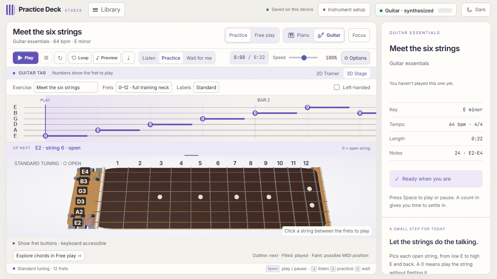

# Practice Deck

## Violin and cello

Choose **Violin** or **Cello** in the instrument picker (or open `/violin/` and `/cello/`).
Each has a drawn fingerboard with scroll, pegs, finger tapes, f-holes and bridge.
Press and hold a place to bow it, drag along a string to slide, and bow near the
bridge for open strings. Keyboard: Tab to the fingerboard once, arrows to move,
hold Enter or Space to bow. The finger chart above it scrolls like guitar tab, with
finger numbers (0 = open string). Six first-position studies per instrument feed the
same lessons, library, path and scoring as the guitar; Free play has a scale explorer
with bow pressure and tempo. The bowed voices are synthesized offline.

The guitar's 3D stage now shows a 3+3 headstock with tuners and the neck running
into an acoustic body (rosette, soundhole, pickguard); the 2D trainer is drawn as a
rosewood fretboard with true fret spacing, pearl inlays and wound strings.

Refresh the welcome-page previews with `node scripts/shoot-instruments.mjs` while
the dev server runs.

## Instrument interaction update

The piano supports held notes, polyphonic pointer input, drag-to-play, sustain,
fixed or key-position velocity, note/computer-key labels, and fit/two-octave/full
views. Use the Key size slider above the stage to resize the keys.
Tab to the piano once, use arrows to select notes, and hold Enter or Space to play.

The guitar has a quieter Three.js neck, upright labels, first-position/full training
neck views, larger labels, and exact string/fret feedback. In Free play, the side
panel contains chord diagrams, finger numbers, open/muted strings, chord tones,
up/down strums, strength, and spread. Tab into the fret buttons once and use arrows
to navigate. MIDI pitches without string information show possible positions;
they do not claim to detect which string you played.

See [instrument validation](validation/instrument-validation.md).

## Desktop studio update

Switch between **Light** and **Dark** from the top bar. Use **Focus** for more playing
space, **Instrument setup** to check your input and sound, and **Free play** to explore
without a score. The unified library includes favorites and remembers your last piece.

On tablets and phones the top bar takes a second line rather than pushing the studio
past the window, and in Free play the chord or scale explorer sits under the stage.
See [narrow layout checks](validation/narrow-layout-validation.md).

See [desktop changes](design/desktop-update.md) and [desktop verification](validation/desktop-validation.md).

## Piano + Guitar studio

Choose **Piano** or **Guitar** above the practice controls. Guitar includes a playable
12-fret board, standard tuning, six authored beginner studies, five chord shapes,
strumming, a left-handed view and an offline synthesized guitar voice. The existing
Listen / Practice / Wait for me modes, tempo, loops and feedback are shared.

Use **3D Stage** for the optional Three.js presentation, or **2D Trainer** for a
simple timing view. Guitar tab stays linear in time in both views. In 3D mode,
**Show fret buttons** provides a keyboard-accessible alternative to clicking the scene.

The 3D guitar draws at one of two detail levels. **Full** adds a studio environment for
the frets, strings and lacquer to reflect; **Light** is the simpler stage for older
computers. **Auto**, the default, picks Full on a graphics card and Light when the
browser is drawing in software. Change it under **Instrument settings → 3D detail**.
Either way the stage redraws only when something on it changes, and lowers its own
resolution a step at a time if frames start arriving late.

At **Full** detail the guitar, violin and cello are downloaded 3D models (credited under
**Help** and in [CREDITS.md](../CREDITS.md)); at **Light** detail the guitar is the simpler
one built in code and the violin and cello keep their 2D fingerboard. If a model cannot be
loaded, the stage shows the light version instead.

Lessons show the neck straight across the stage through a long lens, so the frets keep
their true spacing; the violin and cello maps add finger tapes and numbered markers. In
**Free play** the model is shown whole, from three-quarters (the cello stands on its
endpin), and **Close-up** swings the camera in to the neck to play it. Drag the background
to turn the instrument a little either way, as far as the stage leaves room to keep the
neck in view; double-click or press **Reset view** to put it back. A drag that starts on the
neck plays the note there instead. On the violin and cello, press and hold a place to bow
it, and drag along the string to slide; the bow appears on the string while it sounds.

Guitar input currently means on-screen play or MIDI guitar. **Microphone/audio-interface
pitch detection is not implemented.** The starter exercises score pitch and timing,
not physical fingering or strumming technique. Selecting a piano library item returns
to Piano; guitar studies do not overwrite piano personal bests.

Read [the UI review and roadmap](design/ui-review.md), [validation notes](validation/validation.md),
or run `npm run test:studio` for the focused browser checks.



A local web app for practising piano with an MPK Mini (or any class-compliant MIDI
controller). It reads a MIDI or MusicXML file as the source of truth, listens to
what you actually play, and tells you — immediately, in sound and on screen —
which notes you missed, which ones were wrong, *why* they were wrong in music-theory
terms, and how far off your timing was. Mistakes accumulate across sessions so you
can see whether the bar you keep fumbling is actually getting better.


## Running it

```bash
npm install
npm run songs     # generates the bundled practice library (public/songs/*.mid)
npm run dev       # http://localhost:5173
```

Then: open **Instrument setup** to connect your MIDI controller or test the on-screen
instrument. Press **Play** to enable sound and begin. Choose **Guitar** for tablature,
or **Free play** for ungraded exploration.

```bash
npm test          # 521 engine, parser, grading, storage, guitar and render tests
npm run build     # production bundle into dist/
npm run preview   # serve the production build
```

**Browser support:** Web MIDI needs Chrome, Edge, Opera or Brave. Firefox and
Safari have no Web MIDI API — the app still runs there, you just have to play with
the computer keyboard. `localhost` counts as a secure context, so plain HTTP is
fine; reaching the app from another device on your LAN would need HTTPS.

**No hardware handy?** Play with the computer keyboard: `A`–`J` is the middle-C
octave, `W E T Y U` the black keys, `Z`–`M` an octave lower. Clicking the
on-screen keys works too. Everything is scored identically.

## The three practice modes

| Mode | What it does |
| --- | --- |
| **Listen** | Plays the reference performance so you can hear the piece. Nothing is scored. |
| **Practice** | The clock runs at your chosen speed. Pitch, timing and harmony are all judged. |
| **Wait for me** | The playhead stops at every chord until you play it correctly. The best way to learn something new — you can't fall behind. Never sounds the score to you: the playhead holds on the chord you have to find, so playing it aloud first would give the answer away. |

Supporting controls: playback speed 40–150 %, a hand filter (both / right / left),
a 4-bar loop, a metronome, reference audio on/off, and audible error cues on/off.

### Playing it without letting go of the piano

Both your hands are on a keyboard, so every action that needs a mouse costs you
the position you were in — which is most of what practising a passage consists
of. The whole deck is reachable from the keys:

| Key | | Key | |
| --- | --- | --- | --- |
| `space` | Play / pause | `1` `2` `3` | Listen / Practice / Wait |
| `0` | Stop | `←` `→` | Back / forward one bar |
| `\` | Hear ↔ Your turn | `↑` `↓` | Speed by 0.05 |
| `[` | Loop four bars | `]` | Metronome |

The keys are printed on the controls themselves, in the corner of each pad, the
way gear labels its secondary functions — a shortcut you only find by hovering
something you were already about to click is not much of a shortcut.

Two rules shape the scheme. **No shortcut may take a key that plays a note** —
the letters are the on-screen piano, and a key that sounds a note sometimes and
changes the mode other times is worse than no shortcut at all. `shortcuts.test.js`
checks that against `KEYBOARD_MAP` directly so the two cannot drift. And
**Restart is deliberately unbound**: it throws the run's score away, and an
action you cannot undo should cost a click you meant to make.

### Hear it, then play it

The **Hear** pad plays you whatever is in focus — the looped bars if a loop is
set, otherwise the piece from the top — and while it is playing it becomes
**Your turn**, which drops you back into Practice on the same bars. The same
**♪** button sits beside every trouble spot and every passage the report says
needs work, because those are by definition the bars most worth knowing the
sound of before another attempt.

Both halves cover exactly the same music: hearing a trouble spot and practising
it use one shared window, since a reference that stopped somewhere other than
the attempt would be worse than none. The speed is left alone too — whatever
tempo you are working at is the tempo you are about to try this at, and a
reference arriving faster than the attempt teaches the wrong thing.

This closed a real gap. Listen mode played the whole piece from the top and
cleared any loop on the way in, so the one bar you kept failing was the one bar
you could not hear.

**Reference audio is off by default.** The app sounds your keyboard, not the
score — a note reaching the hit line makes no noise unless you play it. Turn
**Reference** on when you want to hear the piece under your own hands. Listen
mode ignores the setting and always sounds the score; Wait mode ignores it the
other way and never does.

### If nothing is making a sound

The instrument indicator in the top right means *you will hear this*, not *this
is loaded* — it reads `audio.running`, which is the instrument being ready **and**
the audio clock actually going. Those two came apart once and the result was
Listen mode playing an entire piece in silence behind a green light, so if it
says **Enable sound**, click it; the clock is stopped.

A browser will suspend the audio clock when the tab goes to the background, and
sometimes decides the first click never counted. A run now notices that and
restarts the clock itself, once a second, for as long as it is stopped.

If notes still do not sound, the console says so: the audio engine counts every
note it was asked for and could not play and warns on the first one. It used to
log that at `console.debug`, which Chrome hides under Verbose — so a fault that
silenced every note looked exactly like a fault that silenced none.

**Picking the plugin means the browser stops sounding notes.** `instrumentFor`
used to read `instrumentSource === EXTERNAL && midiOutput.available`, so any
moment the port list came back empty — a device re-enumerating, a cable going,
the gap before `attach()` runs on startup — handed the notes quietly back to
the browser while the setting still said "A plugin". Since a plugin is usually
listening to the controller directly as well, that is heard as the app *and*
the plugin at once, with nothing anywhere explaining it. Chosen now means
chosen: if the plugin route is broken it is visibly broken rather than silently
replaced.

**The other way to hear everything twice** is the app forwarding your playing
to a plugin that can already hear your controller by itself. The panel now spots
the clearest case — sending to the same device you are playing — and says so,
rather than switching the forwarding off for you. Some rigs really do loop back
through the controller's own port on purpose, and guessing would be the same
well-meant silent correction as the fallback above.

The external route has the same two checks. In **Using your own instrument**
mode the indicator follows the MIDI port rather than the internal engine, so an
unplugged cable stops claiming to be a working instrument, and notes a port
refuses are counted and warned about under `[midi-out]`. `available` — a port
exists somewhere — and `running` — the one we are pointed at is still there —
are deliberately different questions.

## Fitting a piece to your keyboard

An MPK Mini reaches 25 keys — two octaves. Most of the repertoire spans three or
four, so on a mini controller a piece is not merely hard, it is unplayable: notes
land on keys that do not exist. The app therefore knows how big your keyboard is
and adapts the score to it.

The controller is identified from its MIDI port name (`MPK mini …` → 25 keys,
`Keystation 61 …` → 61 keys) and you can override the guess in **Library ▸ Your
keyboard**. An unrecognised controller is assumed to be a full 88-key piano,
because wrongly constraining a stage piano is worse than leaving a mini keyboard
unconstrained. The window follows your hardware: press OCT+/OCT− on the
controller and play any key, and the app slides its window by whole octaves to
match — the only way those buttons ever move.

Three fitting strategies, in increasing order of how much they change the music:

| Mode | What it does |
| --- | --- |
| **As written** | Nothing. Notes past the end of your keyboard stay unreachable. |
| **Octave shift** | Moves the whole piece by whole octaves so it sits where your hands are. Every interval survives exactly, but a piece wider than your keyboard still spills out at one end. |
| **Fit my keys** | Shifts, then folds any remaining stray note by octaves until it is in range. Pitch classes and rhythm survive; the melodic contour bends. This is what makes a 48-semitone Canon in D playable on 25 keys. |

When fitting is on, the on-screen keyboard shows exactly the keys you own, so it
mirrors the hardware one-for-one. The library marks every piece with what it will
take: **✓ fits**, **↕ octave**, or **⤢ folds**.

Folding is a compromise, so the library also ships five studies written to fit
inside two octaves natively — see the table below. On a Keystation 61 everything
fits and none of this machinery does anything.

## How it looks, and the Stage roll

This section used to say the roll was canvas 2D and would stay that way. The
argument was: under perspective, the screen distance from a note to the hit line
stops being linear in time, so "when does this arrive" — the player's entire
job — becomes a non-uniform judgement down the screen; and foreshortening
narrows the keys at the edges, breaking the one-for-one match between the
on-screen keyboard and your hardware that the fitting work exists to guarantee.

Those are still real tradeoffs, so the app names the choice directly. The
default **Trainer** roll is the canvas view: equal time covers equal distance,
and every key is the same width as the controller under your hands. The optional
**Stage** roll is a perspective WebGL scene available from
**Options -> Roll view -> Stage**. It is intentionally the presentation view:
you stand at the keyboard and the roll recedes away from you, solid note slabs
falling out of the dark and landing on the keys.

Three things are deliberately different in there, and each one is a consequence
of having depth rather than a decoration on top of it:

- **No past strip.** The Trainer roll keeps a fifth of its height below the hit
  line to draw what you actually played beside what was written. With depth in
  the scene that band is not a place where information sometimes appears, it is
  a hole in the middle of the instrument — so the hit line sits on the keyboard
  and a note arrives at the key it belongs to. The key itself lights instead.
- **The keyboard is capped at a keyboard's proportions.** Two octaves stretched
  across a widescreen monitor gives white keys wider than they are long, which
  under perspective reads as paving slabs. Beyond a maximum key width the table
  stops growing and is centred instead. A piece using most of the keyboard never
  reaches the cap.
- **The camera is solved for, not set.** A shallow angle has more vanishing
  point but has to stand further back to get the width of the table into frame,
  which costs the height of the picture; a steep one fills the frame and looks
  like a diagram with a lean. Which wins depends on the shape of the table,
  which changes with the piece, so `rollCamera.js` searches for the shallowest
  angle that still fits and keeps the front of the keys pinned to the bottom
  edge.

**Canvas 2D remains the default and the fallback**, for three reasons that have
nothing to do with taste: it cannot lose a graphics context, jsdom can run it —
so the test suite keeps exercising a real renderer rather than nothing — and it
is what a machine without a GPU gets. A lost context switches back to it and
says so.

What makes two renderers survivable is that neither owns the layout.
`rollGeometry.js` decides where every note belongs and both read it, so they
cannot disagree about the one thing that matters. The 500 kB of Three.js is a
separate lazy chunk; a session that never turns it on never downloads it.

Text is the exception: the GL roll draws note names, fingerings, bar numbers and
the combo read-out on a transparent 2D canvas layered over the scene. Text in
WebGL means a glyph atlas that goes soft when the device pixel ratio changes, or
an SDF font library bigger than the feature.

What actually makes an app like this feel good is feedback and typography, both
cheap:

- **A type scale of seven steps**, with nothing off it. This replaced nineteen
  hand-picked sizes between 9 and 30 px. Sizes that close together read as
  accidental rather than deliberate, and nothing lined up between panels. The
  bottom of the range moved up too — you read this from a metre away at a
  keyboard, not at phone distance.
- **Motion with one vocabulary**: three durations, two easings, and a
  `prefers-reduced-motion` override that collapses them all.
- **Hit flourishes.** A correct note blooms a ring at the hit line and spills
  light down its lane; a mistake pulses red. A run of clean notes lights the
  whole hit line and counts itself off to the side. The score read-outs are
  across the screen — you are looking at the line, so that is where playing well
  should feel like playing well.
- **Notes gain presence as they arrive.** A note four seconds out is
  information; a note about to be played is an instruction. Over its last
  second each one brightens and picks up a bloom in its hand's colour, and once
  it is behind the line it desaturates and recedes. The grid fades with distance
  for the same reason, and the hit line breathes while nothing is playing —
  a frozen still says "stopped", a slow pulse says "ready".
- **A map of the whole piece** sits above the roll, in place of a four-pixel
  progress bar. Notes are drawn as a pitch contour, the bars you keep fumbling
  are ticked in red along the bottom, any loop region is shaded, and clicking
  jumps there. A percentage tells you how far through you are; this tells you
  what is coming.
- **The report arrives rather than appears** — the score counts up, the three
  skill bars fill in sequence, and a personal best gets its own beat.

The roll holds 60 fps with the densest piece in the library. Getting there meant
caching the things that never change between frames: the keyboard is rendered
once and re-blitted until a key or a target actually moves, the vignette
gradient is built per resize rather than per frame, and notes too far away for a
gradient to be visible get a flat fill.
- **Progressive disclosure.** The toolbar carries the seven things you touch
  while playing; reference audio, metronome, error cues, octave and zoom moved
  behind **⚙ Options**. Twenty controls in one row gave the metronome checkbox
  the same weight as Play, which is the wrong answer to "what do I press?".
  The library drawer splits the same way, into **Songs / Keyboard / Progress** —
  it had grown to six sections in one scroll doing three unrelated jobs.
- **Focus.** While a run is playing the setup chrome — key count, MIDI port,
  active instrument — drops back to a fifth of its opacity and returns when you
  reach for the topbar. Opacity only, never collapse: hiding any of it would
  reflow the toolbar at the exact moment you are trying to land a note. The
  drawer closes itself when a run starts, for the same reason.
- **Nothing moves that you are not moving.** Verified by measuring every control
  in the topbar and toolbar before and after a run starts and asserting the
  boxes are identical. That check found two long-standing wobbles: `▶ Play`
  becoming `⏸ Pause` is thirteen pixels wider and slid the whole toolbar, and
  the instrument slot resized twice a session — once on the first note, again
  when the sampled piano finished downloading.

## The practice report

Every run ends with a verdict: a star rating out of five, the three skills
broken out so you can see which one let you down, the passages that need work,
and one thing to do next.

**The rating is meant to be capable of being bad.** Notes are weighted hardest
(55, against 30 for timing and 15 for touch), because playing the wrong pitch
makes everything else moot. Two guards keep the stars worth chasing:

- **A run that covers less than 60 % of the piece is not graded.** It shows the
  full breakdown and says *Incomplete*, but awards no stars and sets no record.
  Without that, quitting the moment things went wrong would be the reliable
  route to a high score — the opposite of practising.
- **Timing and touch are ratios over the notes you actually hit**, so they mean
  nothing when there are barely any. Below a floor that scales with the length
  of the piece, both are reported as unmeasured and their weight falls back onto
  the notes. Two lucky notes struck at the written velocity used to read as
  "100 % dynamics" and drag a collapsed run up towards a pass.

"What to work on" collapses individual mistakes onto bar numbers and merges
adjacent bars, because *"you missed twelve notes"* is a fact and *"bars 5–6 are
where it falls apart"* is an instruction. Each one is a button that loops those
bars and slows them down.

Records are kept per **arrangement**, not per piece. A folded 25-key run, a
right-hand-only run and a full 88-key run of the same music are different work,
so they never share a personal best.

Your longest clean streak is one of those records, and it is the one you are
told about **while you are still playing**: pass it and the hit line turns warm
and reads `NEW BEST · N in a row`. A record you find out about on a results
screen twenty seconds after the moment passed is a statistic. The engine had
always counted this per run and thrown it away at the end of each one.

### Hearing it back

The report can play the run to you, which is the one thing a teacher does that
no number on the screen can. Two buttons, because they answer different
questions:

- **Hear yourself** — your run alone, at the velocities you actually played. An
  uneven hand is obvious in the ear and nearly invisible in a percentage, and
  the person who has just played something is the worst-placed one to say how
  it sounded, because they were busy playing it.
- **Against the score** — your run with the written notes underneath it, a
  little quieter. This exists because playing a run back on its own answers the
  less useful half: it tells you what you did, and it cannot tell you what you
  should have done. It also thins out exactly where it is needed most — a run
  you mostly missed plays back as a handful of disconnected notes with nothing
  to judge them against. Against the score, every mistake becomes audible as
  itself: a missed note is a bar where only the reference sounds, a wrong one
  is a clash, and dragging is you arriving behind something steady.

Both parts share a timeline anchored on the earlier of the two first notes, so
if you came in two bars late you hear yourself come in two bars late. Anchoring
each part to its own first note would quietly correct the mistake you are
listening for.

If you played nothing at all, the second button becomes **Hear the score** —
that run is precisely the one where hearing how the piece actually goes is
worth the most.

## Playing one hand

Pick **R** or **L** and the app plays the other hand for you rather than
deleting it. Practising a right hand in silence is a memory test; practising it
against the left is music, and hearing the part you are fitting into is most of
what makes single-hand practice worth doing.

The accompaniment is drawn faintly behind the notes you have to play, never
counts as a hit or a miss, and sounds whether or not **Reference** is on — it is
not the reference performance, it is the other half of the piece. It also counts
as harmony when judging what you played over it, so a right-hand note is
measured against the chord underneath rather than against nothing.

When a score is fitted to a small keyboard, the fit is calculated from the notes
*you* play. The accompaniment comes out of the speakers, so squeezing it into
your two octaves would mangle the bass for no reason.

## Using your own instrument

A browser cannot host a VST or AU plugin — they are native code expecting a host
process, and there is no web sandbox that runs them. But it can send one notes,
which gets you the real thing. Two routes, both in **Library ▸ Your keyboard**:

**Point it at a plugin.** Choose *A plugin*, pick a MIDI output port, and your
instrument makes the piano sound while the app keeps reading and judging your
playing. On an MPK Mini this is nearly free: the controller already exposes a
port built for AIR plugins. The metronome and error cues deliberately stay in
the browser — they are not piano sounds, and a buzz cue through a grand piano
patch would be nonsense. If your plugin already hears the controller directly,
turn off **Send my playing too** or you get every note twice.

**Or drop in samples.** Bounce a few notes out of your instrument — one per
octave is plenty — name them for the pitch they record (`C4.wav`, `Ds3.wav`,
`Bb2.wav`), and drop them on the panel. The app reads the pitch from the
filename, stores the audio in IndexedDB and plays everything in between by
shifting the nearest sample. No manifest to write, no rebuild.

## A reason to come back

Daily practice is the single biggest determinant of how quickly anyone improves,
which is why every serious practice app tracks it. The streak here is meant as
evidence of that, not decoration — so it is hard to fake. **A day counts only
when you actually practised**: one complete run, or three minutes at the keys.
Opening the app earns nothing, and a run where you played no notes at all is not
recorded. It is the same principle as the coverage guard on stars.

Alongside it, a ring for the day's goal, which you can set anywhere from five
minutes to an hour.

## Exercises built from your own mistakes

The trouble map has been accumulating across every run of a piece — which bars
you miss, where you play the wrong note, where you drag. Until now it only lit
bands on the roll and offered a four-bar loop. **Build me an exercise**, under
Trouble spots, turns it into a study.

It takes the worst spots, collapses several inside one bar into one problem,
merges adjacent bars into a single longer passage, and cuts each one out of the
piece with a bar of run-up so you arrive in context rather than cold. Each
passage is played twice, separated by a bar of silence, in the order they occur
in the music rather than by severity. It opens at 70 % speed.

A drill keeps its own identity — `drill:<songId>` — so practising one never
writes to the parent piece's stars. The way back sits in the topbar rather than
the piece panel, because that panel is replaced by the scoreboard the moment you
play a note, and a way out that disappears is not a way out.

Every other app lets you loop a section you choose yourself. None of them
assembles one from what you have actually been getting wrong, which is strange,
because it is the obvious use of the data.

## Touch you can trust

The app grades your touch — dynamics is part of the star score — by comparing
the velocity your controller reported against the one written in the score.
Those are only in the same units if the controller is linear, and mini
controllers emphatically are not. Play as softly as you physically can on a
25-key and it may still report half the range; press firmly and it saturates
long before you are really playing loudly. Judged raw, that reads as someone
who thumps everything and cannot shade a phrase — a fact about the hardware,
not about them.

`grading.js` has always known this. Its comment on `WEIGHTS` says so outright,
and its answer was to care less: dynamics weighted down to 15% so the hardware
could not do too much damage. That is a workaround for a missing measurement,
and it penalises the person on a weighted 88-key stage piano whose touch is
worth listening to.

**Library ▸ Your keyboard ▸ Touch ▸ Calibrate** measures it instead. Three
passes — eight notes as softly as you can, eight comfortable, eight firm — and
the app takes the median of each (one fumbled note would drag an average far
enough to make the correction worse than none) and maps the range your hands
and your hardware produce together onto the range the music is written in. The
curve is drawn with dynamics markings up the side rather than MIDI numbers,
because ppp to fff is the unit the score is in.

A calibration it cannot trust is **refused, not stored**: too few notes, three
passes that did not get louder, or a range too narrow to map all come back as a
sentence explaining which, and nothing changes. Storing a guess there would
make the dynamics score worse than leaving it alone, which is the one outcome
the feature has to avoid.

The correction is applied at a single seam — the same place `inputLatencySec`
corrects timing — and to **the sound as well as the scoring**. A correction that
fixed your score but not what came out of the speakers would have you playing
to a meter instead of to your ears.

Two things deliberately left alone: the 15% weight stays where it is (raising
it because the number became trustworthy would silently rescore every run you
have ever done), and a calibration does not split your history the way an
arrangement does — it is a correction to you, not a different piece. Each run
records whether it was calibrated, so a maintainer comparing dynamics across a
year can see where the measurement changed.

## Timing you can trust

Two things had to be true before a rating meant anything.

**A count-in.** Every piece begins on beat one, so pressing Play used to put the
first note on the hit line instantly — unhittable, and a guaranteed miss on
every single run. Now the clock starts a bar early and counts you in. Nothing is
judged while it runs, so noodling along to the click costs you nothing. The
score is untouched: the clock simply starts at a negative time, which also gives
the opening notes their run-up down the screen.

**Latency calibration.** You play in time with what you *hear*, and your
speakers are always a buffer behind your fingers, which makes good playing
measure as late. **Library ▸ Your keyboard ▸ calibrate** ticks a click, has you
tap along, and takes the median offset — the median rather than the mean, so one
fumbled tap cannot skew the correction into making things worse. The result is
subtracted at the single point where hardware time becomes song time.

## How mistakes are judged

Four independent checks run on every note you play.

**1. Is it the right pitch, at roughly the right moment?**
A key press is matched to the nearest unplayed target of the same pitch within
±350 ms. Match found → hit; the timing deviation is recorded and labelled
*on time* / *early* / *late* against a ±90 ms window. No match → it's an extra
note, and check 2 runs. A target that goes 400 ms past its onset without being
played is marked *missed*.

**2. Why is the wrong note wrong?** (`src/lib/theory.js`)
This is the part that makes the feedback useful rather than just red. The played
pitch is compared against the notes actually sounding in the score at that
instant, the chord they form, and the estimated key of the piece:

| Verdict | Meaning | Severity |
| --- | --- | --- |
| Right note, wrong octave | correct pitch class, wrong register | 0.20 |
| Harmonically fine, not in the score | a chord tone — sounds OK, isn't written | 0.35 |
| Wrong note, still in key | diatonic, but a non-chord tone | 0.50 |
| Adjacent key slip | a semitone off a target: a hand-position problem, not an ear problem | 0.60 |
| Out of key | foreign to the key | 0.85 |
| Dissonant clash | foreign *and* a semitone or tritone against a sounding note | 1.00 |

Severity drives both the colour on screen and how ugly the error cue sounds, so
you can tell a harmless octave slip from a real clang without looking up.

Chords are identified by scoring every root/quality pair against the sounding
pitch classes, which handles inversions, doublings and incomplete voicings. The
key comes from a Krumhansl–Schmuckler correlation over a duration-weighted
pitch-class histogram; for minor keys the natural, harmonic and melodic forms are
unioned, so a raised 7th in a cadence isn't reported as an error.

**3. Are you drifting?**
Signed timing deviations are averaged over the run, so the panel can tell you
"you're rushing by 60 ms" rather than just showing a percentage.

**4. How hard did you hit it?**
Every hit records the MIDI velocity you played against the velocity written in
the score. A press more than 0.28 (about 36 of 127) from the written level is
called *harder* or *softer* and named in the live feed — "struck softer than
written (25 vs 99)". Two numbers come out of it:

- **Dynamics** — the share of hits inside that window, plus your average offset
  from the score.
- **Evenness** — the standard deviation of your own velocities, ignoring the
  score entirely. This is the more useful of the two on an exercise: a scale
  played at a consistent weight sounds right even if it is not at the level the
  file asked for, and a lumpy one shows up here as a wide spread.

The window is deliberately generous. These arrangements carry broad-brush
dynamics, and the signal worth having is a hand that thumps or fades, not a few
points of MIDI velocity.

The run panel also lists **which** pitches you played that the score did not
want, not just how many — so "3 wrong" becomes "C4, C♯4, F♯4".

## Visualisation

One canvas, four zones stacked vertically:

```
┌─────────────────────────────┐
│  future: targets falling    │  right hand blue, left hand violet
│                             │  bar lines + bar numbers, octave lanes
├═════════════════════════════┤  ← the hit line: play what crosses it
│  past: outcome + YOUR notes │  targets go green/red, your notes overlay
├─────────────────────────────┤     as narrower bars, so target vs. performance
│  keyboard                   │     sit literally side by side
└─────────────────────────────┘
```

The keyboard highlights the notes you should be holding (teal) and the ones you
are holding (green / amber / red by verdict). Faint red horizontal bands mark
places you have historically got wrong — they show up *before* you reach them.
Click anywhere in the roll to seek; click a key to hear it.

## Persistent progress

Everything is stored in `localStorage` under `piano-practice-coach:v1`, per song.
That key, the `piano-practice-coach/backup` format string and the IndexedDB
database name kept the old product name deliberately: renaming a storage
namespace orphans every practice history and every backup file already on disk,
which is a high price for a string nobody sees. Per song:

- **Sessions** — accuracy, timing, missed/wrong counts, mode and speed for every
  run, drawn as a sparkline with best-run highlighting and a change indicator.
- **Trouble spots** — cumulative miss/wrong/late counts keyed by position in the
  score. The worst offenders are listed worst-first; click one to loop those four
  bars immediately.

## The bundled library

`npm run songs` generates eighteen pieces. All are **public domain** — the
composers died well over 70 years ago, or the tune is traditional. Recent chart
hits are still under copyright and are deliberately not included; use the file
loader for anything you hold a licence to. Imported files are remembered in
IndexedDB, so "Your files" is still there tomorrow.

| Piece | Level | Why it's here |
| --- | --- | --- |
| C Major Scale, two octaves | ★ | Parallel hands. Timing evenness before speed. |
| Triads & Arpeggios in C | ★★ | I–ii–IV–V–vi–I: gives the harmonic checker real chords to reason about. |
| Twinkle, Twinkle, Little Star | ★ | Checks your controller, your latency and your ears in 30 seconds. |
| Ode to Joy — Beethoven | ★★ | Stepwise melody over block chords; a solid first two-hand piece. |
| Für Elise (opening) — Beethoven | ★★★ | The E–D♯ alternation makes the adjacent-key-slip detector earn its keep. |
| Prelude in C, BWV 846 (bars 1–8) — Bach | ★★★ | Pure broken chords, so every chord you play over gets named. |
| Canon in D — Pachelbel | ★★★ | The ground bass twice: half notes, then eighth-note variation. |
| Moonlight Sonata, mvt I (opening) — Beethoven | ★★★★ | Even triplets. The timing report is brutally honest here. |
| Twinkle (MusicXML import) | ★ | The same tune read from MusicXML — proves that import path works. |

### Two-octave studies

These are arranged to sit inside 24 semitones, so a 25-key controller plays them
exactly as written — no folding, no unreachable notes.

| Piece | Level | Why it's here |
| --- | --- | --- |
| Five-Finger Warm-up in C | ★ | C–G under five fingers, hands an octave apart. No thumb crossing. |
| Twinkle (two-octave version) | ★ | Single bass roots instead of spread chords. |
| Ode to Joy (two-octave version) | ★★ | The first eight bars over a walking bass. |
| Chord Shapes in C (close position) | ★★ | I–vi–IV–V7–I–ii–V7–I with the right hand never leaving one position. |
| Für Elise (two-octave version, C minor) | ★★★ | Transposed so it lines up with a C keybed; every interval of the original intact. |
| Amazing Grace (F major) | ★ | Pentatonic throughout — no wrong black key to hit. A gentle first piece in three-four. |
| Greensleeves (D minor) | ★★ | The first minor-key tune here; the raised leading note gives the harmony checker a real decision. |
| Scarborough Fair (D dorian) | ★★ | A minor tune with a major sixth in it. Slow, spacious, unforgiving about even timing. |
| The Entertainer (opening strain) — Joplin | ★★★ | Ragtime syncopation over a steady off-beat bass. The timing report earns its keep here. |

Three of those are transposed, and not arbitrarily. The app can only move a
piece by whole octaves, so a tune whose lowest note is a G can never line up
with a keybed that starts on C unless it is unusually narrow. Moving the key
keeps every interval of the original and costs only the pitch.

That last transposition is not arbitrary. The app can only move a piece by whole
octaves, so an A-minor arrangement would have to squeeze into fifteen semitones
to align with a keybed that starts on C — narrower than the theme itself. Moving
the key instead keeps the music and loses only the pitch. `build-songs.mjs`
asserts this for every study, so a two-octave piece that does not actually fit
fails the build.

The arrangements are simplified practice studies: opening sections, thinned
textures, comfortable registers. They are not urtext editions.

## Reading the music

**Roll · Both · Staff** in the toolbar. Falling notes tell you *when*; a staff
tells you *what*, and every review of an app in this space makes the same point
— blocks build reflexes, not reading. "Both" puts notation above the roll, which
is the useful middle while you still want the timing cue underneath.

The engraving itself is VexFlow. It is the one thing here worth a dependency:
beams, rests, accidentals, ties and spacing are not worth hand-rolling. But it
weighs more than the rest of the app put together, so **it is loaded only when
you ask for notation** — a session that stays on the roll never fetches it. The
main bundle is 160 kB gzipped; notation adds 391 kB the first time you open it.

The work that is ours is [notation.js](../src/lib/notation.js), and it is almost
entirely quantisation. A score holds onsets and lengths in seconds; notation
needs bars, note values, rests for the silence, and ties where a note runs over
a barline. Lengths are snapped to sixteenths — finer than that and human timing
becomes confetti — then expressed greedily as note values, so two and a half
beats comes out as a half tied to an eighth, which is what an engraver writes.
Hands take a stave each, falling back to middle C for files that carry no hand
information.

All of that is pure and tested without a canvas, including the property that
matters most: **every bar adds up to a full complement of beats.** A bar that
does not balance will not engrave, and the renderer cannot tell you that a
rhythm is wrong — only that it could not lay it out.

The window turns a page at a time rather than scrolling continuously. Reading is
done in bars, and a staff sliding under your eyes is harder to follow than one
that turns.

## Fingering

Which finger, not just which note — the question the app never used to answer.
**Options ▸ On each note ▸ Finger** writes 1–5 on the falling blocks instead of
the pitch name. Only one label fits on a note, so it is a choice rather than an
addition.

The fingering is **authored, never inferred.** Automatic fingering is a hard
problem and a wrong answer is worse than no answer — a learner following bad
fingering builds a habit that is harder to unlearn than none at all. So the
pieces this app generates carry fingering written into `build-songs.mjs`, and
imported files show none.

It currently covers the studies where fingering is genuinely determined rather
than a matter of taste: the two-octave C major scale (thumb tucks under after
the third and seventh degrees going up, third finger crosses coming down), the
five-finger warm-up, and the close-position chord shapes.

Because it travels alongside the notes by position, the build re-parses every
file it writes and refuses to ship if the note count does not match the
fingering it emitted.

## Your controller against 88 keys

Under **Library ▸ Keyboard** there is a whole piano an inch wide, with your
controller's window lit on it and a mark underneath showing the span the current
piece needs. Click anywhere to move the window. The app has always known which
keys you physically have; it used to say so in words — *"25 keys · C3–C5"* — and
a picture you can read beats a fact you have to decode.

The idea is lifted from the strip along the top of GarageBand's keyboard, which
is also where the keys got their gloss: a specular stripe down each black key, a
seam shadow between the whites, and a lit front lip. The keyboard map remains
canvas 2D. The optional Stage roll uses WebGL only for the main falling-note
view, where the extra cost buys a more physical presentation.

## Browsing by composer

The library groups into collections, so nineteen pieces in a column become a
catalogue. Beethoven has six entries — *Ode to Joy*, *Für Elise* and the
*Moonlight* opening, each with a two-octave version where one exists, plus the
opening of the Fifth. Picking a composer filters the list and opens a card with
their dates and a note on the pieces.

Every work has a **listen** button beside it, which loads the piece and plays it
straight through in Listen mode. Knowing what something sounds like is most of
deciding whether to spend twenty minutes on it, and that should be one click.

**Pieces can state their own key.** Estimation works from what sounds, which is
almost always enough — but the opening of the Fifth is four notes and never
touches its own tonic, and the estimator landed on D minor while honestly
reporting the lowest confidence in the library. Generated pieces now carry their
key and time signature in the manifest; imported files are still estimated.

That also fixed a quieter bug: the generator clears the header's time
signatures, so **every piece was being read back as 4/4** — and bar numbers in
the practice report and in generated drills are derived from it, so every
reference to "bars 5–6" was wrong for anything in 3/4, 6/8 or 2/4.

## Your own files

Drag a `.mid`, `.midi`, `.xml` or `.musicxml` file onto the sidebar, or browse for
it. Two-track MIDI files are read as right/left hand; single-track files are split
at middle C. The MusicXML reader handles divisions, chords, `backup`/`forward`,
ties across barlines, multiple staves and `<sound tempo>`. Compressed `.mxl` is
not supported — unzip it and load the `.musicxml` inside.

Imports are kept as their original bytes in IndexedDB and re-parsed on load, so
a change to the reader reaches everything you ever imported. If one of them can
no longer be read the app now says which — it used to drop them silently on the
grounds that it "wasn't worth a toast on load", but the file does not come back
and nothing else mentions it, so from the other side of the screen a piece you
imported has simply vanished and the app is the thing that lost it. A browser
with no IndexedDB at all says nothing, because there was never a vault to lose
anything from.

## Sound

The audio engine tries three sources in order and shows which one it got:

1. **Your own sample pack** in `public/samples/` — see
   [`public/samples/README.md`](../public/samples/README.md) for the layout and for
   an honest explanation of why a browser can't host a VST but can play the same
   samples the VST uses.
2. **Salamander Grand Piano** over CDN — a real sampled acoustic grand.
3. **Web Audio synthesis** — no downloads, fully offline, sounds synthetic.

Error cues are synthesised on the spot: a dull thud for a missed note, a soft
click for sloppy timing, and a detuned dyad for a wrong note whose interval gets
nastier as the severity rises.

## Code layout

```
src/
  lib/
    theory.js       scales, key estimation, chord ID, wrong-note classification
    score.js        MIDI + MusicXML → one normalised Score shape
    matcher.js      PracticeSession: hit/miss/timing bookkeeping, both modes
    transport.js    the song clock + audio scheduler
    audio.js        instrument loading, playback, error cues, metronome
    midiInput.js    Web MIDI: enumeration, hot-plug, message normalisation
    keyboard.js     key geometry shared by roll and keyboard
    devices.js      controller profiles + the playable-key window
    arrange.js      bends a score onto that window (shift / fold / hand filter)
    grading.js      a run → stars, skill bands, and what to say about them
    passages.js     individual mistakes → "bars 5–6"
    coaching.js     the single recommended next action
    latency.js      median tap-offset maths for calibration
    streaks.js      daily practice ledger and streak arithmetic
    midiOutput.js   sending notes to a plugin or hardware instrument
    vault.js        IndexedDB: imported files and sample packs
    storage.js      localStorage sessions + trouble map
    velocity.js     fitting a touch curve to a controller's real range
    shortcuts.js    which key does what, and which keys are off limits
    rollGeometry.js shared roll layout: time, hit line, keyboard strip
    rollPaint.js    roll palette, note/key drawing constants, tuning dials
    rollCamera.js   where the Stage camera stands, as pure arithmetic
    rollScene.js    optional WebGL Stage renderer
    stage/          the 3D string stage: studio.js (renderer, lights, floor, camera),
                    environment.js (soft boxes to reflect), quality.js (full or light),
                    framing.js (where the camera stands), views.js (lesson and free-play lenses),
                    turntable.js (drag to turn, ease back), pacing.js (resolution for frame rate),
                    stageRunner.js (the loop both string stages run on), models.js (loading
                    the downloaded models), modelFinish.js (lacquer and shadows), stageBars.js
    guitarNeck.js   where frets, strings and playable places sit on the 3D neck
    guitarRig.js    the code-built guitar, its click targets and markers
    guitarModelRig.js  the downloaded guitar, made playable
    guitarStageView.js  marker styling and labels, decided without Three.js
    bowedNeck.js / bowedRig.js / bowedBow.js / bowedStageView.js  the 3D violin and cello
    modelCredits.js the CC BY credits for the downloaded models
  hooks/
    usePracticeEngine.js   the one place engine, MIDI and React meet
    usePassages.js         hearing, looping and drilling a stretch of music
    useComputerKeyboard.js QWERTY as both the piano and the deck's shortcuts
    useImports.js / useKeyboardSetup.js / usePathData.js
  components/
    PianoRoll.jsx   the canvas view (owns its own rAF loop)
    KeyboardPanel.jsx  which controller you are on and how scores fit it
    PracticeReport.jsx the end-of-run verdict
    LatencyCalibrator.jsx  tap-along timing calibration
    TouchCalibrator.jsx    three-pass velocity calibration
    VelocityCurve.jsx      the correction, drawn in ppp–fff
    StreakStrip.jsx    daily practice at a glance
    TopBar / SongLibrary / Controls / FeedbackPanel / HistoryPanel
scripts/
  build-songs.mjs   generates the bundled library
  models/           prepares the downloaded 3D models: `node scripts/models/prepare.mjs`
                    reads models-src/<name>/scene.gltf and writes public/models/<name>.glb + .json
```

**No file over 800 lines.** `App.jsx` is the one that keeps drifting towards it,
and every hook in the list above exists because it crossed the line once. The
rule earns its keep by being enforced rather than admired: adding the passage
controls and the keyboard shortcuts pushed App to 993 lines, and `usePassages`
and `useComputerKeyboard` are what brought it back to 717.

Three deliberate choices worth knowing about:

**The master clock is `performance.now()`, not the audio clock.** That's the same
time domain as `MIDIMessageEvent.timeStamp`, so an incoming note is placed on the
timeline using the hardware's own timestamp rather than whenever React happened
to notice it. Audio is converted to Tone's clock only at the moment of
scheduling, which keeps playback jitter-free without compromising input timing.

**Frame-rate state lives in refs.** The canvas reads engine state directly in its
own rAF loop; React state refreshes about twelve times a second for the numeric
read-outs. A dense passage therefore causes zero extra re-renders.

## Tests

`npm test` runs 458 tests in 24 files. The logic that decides what you are told
about your playing lives in `src/lib/` as pure modules precisely so it can be
tested without a browser, a keyboard or a canvas.

**Judging what you played**

- `engine.test.js` (45) — key estimation, chord ID, all six wrong-note verdicts
  and their severity ordering, and the matcher's hit/miss/timing bookkeeping in
  both timed and wait modes.
- `grading.test.js` (44) — star bands, the notes/timing/dynamics weighting, and
  what happens when a band has too few notes to read.
- `dynamics.test.js` (26) — velocity against the written level, evenness, and
  repeated pitches.

**Progress and what it means**

- `path.test.js` (44) — the curriculum, the tempo ladder, unlocking, the daily
  set and the benchmark.
- `streaks.test.js` (28) — the day ledger, goals and streak arithmetic.
- `stars.test.js` (15) — best-star badges and the tempo they were earned at, and
  the longest clean streak per arrangement.
- `ghost.test.js` (8) — that the ghost only ever holds your best, and never
  races a folded arrangement against the full one.
- `backup.test.js` (11), `vault.test.js` (10) — export/import and the sample
  store.

**Reading and arranging the music**

- `parsers.test.js` (14) — parses the actual generated files back and checks the
  melodies, hands, tempi, keys and the MusicXML tie merge. A regression in the
  reader can't quietly turn into "you played a wrong note".
- `arrange.test.js` (29) — octave fitting, folding, hand filters and the variant
  key that keeps their records apart.
- `notation.test.js` (19) — note and rest durations for the engraved staff.
- `drills.test.js` (15) — exercises built from your own trouble spots.

**Everything else**

- `playback.test.js` (23) — turning captured key presses into playable clips for
  "hear yourself", putting your run and the score on one timeline so a late
  entry stays late, and that stopping actually stops.
- `velocity.test.js` (18) — fitting a touch curve to three measured passes, and
  refusing to store one that would make the dynamics score worse than none.
- `shortcuts.test.js` (14) — which key does what, and — the one that matters —
  that no shortcut ever claims a key that plays a note.
- `speech.test.js` (13) — spoken coaching.
- `audio.test.js` (9) — the difference between an instrument being loaded and a
  note through it being audible, and that a note which fails to sound is
  counted rather than swallowed.
- `midiOutput.test.js` (10) — the same two questions for an external plugin or
  hardware module: whether the selected port is still there, and whether notes
  it refused are counted rather than discarded in silence.
- `app.test.jsx` (15) — mounts the whole app against a stubbed fetch/canvas,
  switches songs, starts a run, feeds synthetic MIDI in and asserts that the
  wrong note gets explained and the session gets persisted.
- `useImports.test.jsx` (8) — restoring the files you imported, and that one
  which can no longer be read is named rather than quietly missing.
- `rollGeometry.test.js` (23) — where every note belongs, and above all that
  screen distance to the hit line stays linear in time.
- `routing.test.jsx` (5) — that "This app" and "A plugin" are genuinely
  exclusive, including when the plugin's port drops after you chose it.
- `ErrorBoundary.test.jsx` (6) — that a crash offers you your data back.

## Known limits

Two entries here went stale and were removed: velocity and dynamics *are*
judged — `dynamicsBand` in `grading.js` is 15% of the star score — and the staff
view *does* engrave, via VexFlow in `StaffView.jsx`. Both had been true once,
and both survived long enough to mislead someone reading this file to find out
what the app could not do. What remains:

- Sustain pedal (CC64) releases held notes, but pedal timing isn't scored. The
  MPK Mini this app is built around has no pedal input, so this is only a limit
  on larger controllers.
- The staff is engraved from the note data, not from the source file's own
  layout. Beaming, voicing and line breaks are the app's choices, not the
  publisher's.
- Ornaments, repeats, `D.C.`/`D.S.` jumps and multi-voice tuplets in MusicXML are
  read literally, not expanded.
- Manual octave transposition (the Octave slider) writes to the same history
  entry as the untransposed version. Fitting does not: `variantOf` in
  `arrange.js` keys history, ghosts and star badges by fit mode, keyboard span
  and hand filter, so a folded 25-key run never shares a record with the full
  piece. Octave shifts are left together on purpose — every interval and the
  whole contour survive them, so it is the same work.
- The daily streak's "best stars today" is a plain maximum over the day's runs
  and ignores the speed they were played at. The per-piece badges do not — see
  below.

### Stars and tempo

Five stars at 60% is not five stars, and until recently the library badges said
it was. `path.js` had always known better — passing and mastery are gated on
`atTempo` — but `getAllBestStars` took a plain maximum over every run, so a
clean slow attempt put five gold stars beside Moonlight Sonata.

The rating is not withheld, because slowing a piece down until it is clean is
the method this whole app teaches and scoring that zero would punish taking its
advice. It is qualified instead: the stars stand, with the tempo attached as a
small tag. Ties on stars break towards the faster run, so the badge always
reports the most impressive true version of what happened. `src/lib/stars.test.js`
pins the rules down.
