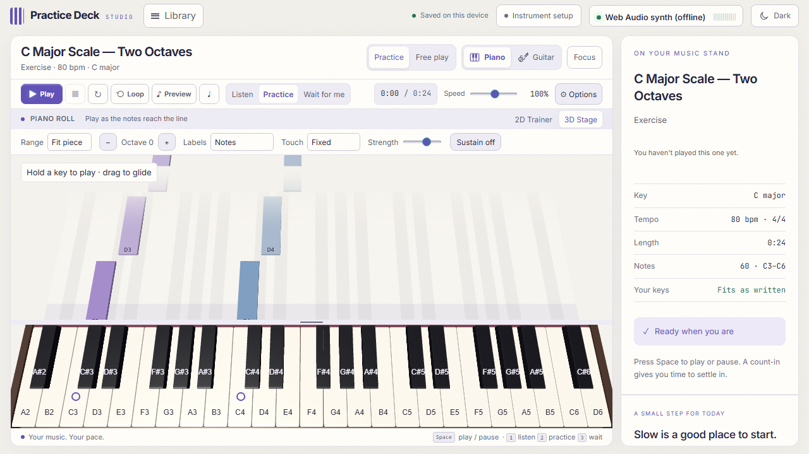
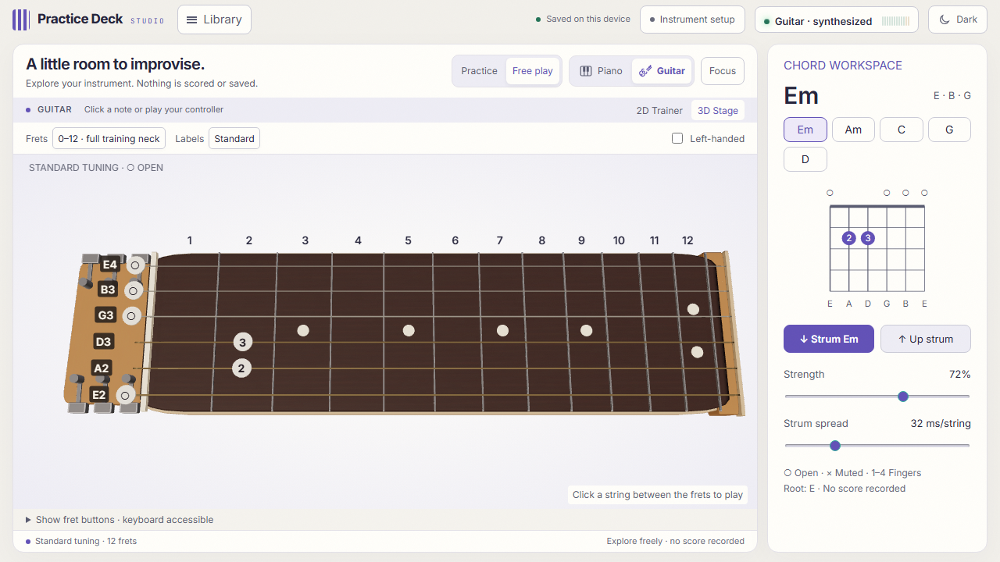

# Instrument UI update — 21 September 2026

## Delivered

- Compact desktop transport and headings; the instrument remains visible at 1280×720. Light/dark themes and Focus remain available.
- Piano: 164px default key bed, adjustable height, quieter Three.js depth, actual key-face hit testing, held notes, polyphonic pointer input, glissando, pointer cancellation and window-blur cleanup. Target rings are separate from depressed played keys; hit/wrong/timing symbols supplement colors. Reduced motion skips key travel.
- Piano controls: fit/two-octave/full range, octave, note/computer-key/off labels, fixed/position velocity, playing strength and sustain. One keyboard navigation stop with announced note names and middle C.
- Guitar: matte neck, compact headstock, calmer lighting, screen-sized upright labels and chord finger numbers, 0–5/0–12 views, large labels, correctly mirrored left-handed picking, and exact string/fret feedback. Pitch-only MIDI shows alternative positions instead of claiming string detection.
- Chord workspace: conventional open/muted/finger diagrams, tones/root, down/up strumming, strength and per-string spread. Independent strings can ring together. Accessible fret buttons use arrow navigation instead of dozens of tab stops.

## Checks

- `npm test`: 520 tests passed across 29 files, including scoring, transport, parsing, saved history, routing and new input ownership tests.
- Focused browser checks: 23 unique scenarios passed. After a concurrent screenshot run caused a browser teardown timeout, the 12 desktop/instrument scenarios were rerun alone and all passed. No assertion was relaxed to resolve that timeout.
- Browser coverage includes audible input, practice results/history, WebGL context fallback, theme persistence during an active session, pointer hold/glide/cancel, sustain/blur cleanup, keyboard navigation, exact guitar picks in both handedness settings, ambiguous MIDI positions, and opposite up/down strum ordering with selected velocity.
- Desktop bounds checked at 1280×720, 1366×768 and 1920×1080. A 960×540 effective CSS viewport, corresponding to 200% zoom on a 1920×1080 desktop, keeps the center pane scrollable without horizontal overflow. This is an effective viewport check, not a native browser zoom certification.
- Range checks confirmed 25 semitones in the two-octave view and 88 keys in the full view. Light/dark piano and guitar screenshots inspected.
- Production build succeeds. Three.js and score engraving remain lazy-loaded. Existing large-chunk notices remain; no dependencies were added for this update.

## Limits

Physical MIDI hardware, screen-reader speech and microphone guitar detection were not tested. The guitar uses the existing synthesized voice. Optional remote piano samples were unavailable in the test environment; audible offline fallback was verified. These are desktop changes; mobile was outside the requested scope.

The practice engine, note matcher, scoring rules, importers, and saved-history schema were not changed.

